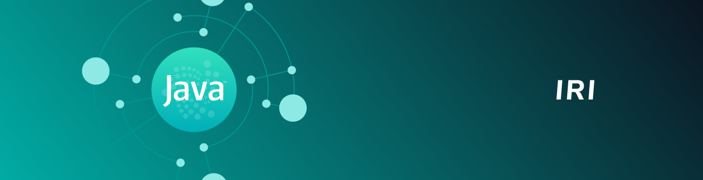

<h1 align="center">
  <br>
  <a href="https://docs.iota.org/docs/node-software/0.1/iri/introduction/overview"></a>
</h1>

<h2 align="center">The official node software that runs on the IOTA Mainnet and Devnet</h2>

<p align="center">
    <a href="https://docs.iota.org/docs/node-software/0.1/iri/introduction/overview" style="text-decoration:none;">
    
</p>
<p align="center">
  <a href="https://discord.iota.org/" style="text-decoration:none;"></a>
    <a href="https://iota.stackexchange.com/" style="text-decoration:none;"></a>
    <a href="https://raw.githubusercontent.com/iotaledger/iri/dev/LICENSE" style="text-decoration:none;"></a>
    <a href="https://www.codacy.com/app/iotaledger/iri" style="text-decoration:none;"></a>
    <a href="https://travis-ci.org/iotaledger/iri" style="text-decoration:none;"></a>
</p>
      
<p align="center">
  <a href="#about">About</a> ◈
  <a href="#prerequisites">Prerequisites</a> ◈
  <a href="#installation">Installation</a> ◈
  <a href="#getting-started">Getting started</a> ◈
  <a href="#api-reference">API reference</a> ◈
  <a href="#supporting-the-project">Supporting the project</a> ◈
  <a href="#joining-the-discussion">Joining the discussion</a> 
</p>

---

## About

The IRI (IOTA reference implementation) is open-source Java software that runs on the IOTA Mainnet as well as the Devnet. This software defines the current IOTA protocol, which allows nodes to do the following:

- Validate transactions
- Store valid transactions in a ledger
- Allow clients to interact with the them through a an HTTP API

This is beta software, so there may be performance and stability issues.
Please report any issues in our [issue tracker](https://github.com/iotaledger/iri/issues/new).

## Prerequisites

To run IRI, you need the following:

- 4GB RAM
- 64-bit processor
- A public IP address that's either static or connected to a dynamic DNS service such as [duckdns.org](https://www.duckdns.org)
- [Java](https://openjdk.java.net/install/)
- [Maven](https://maven.apache.org/what-is-maven.html)
- Ports 15600 and 14265 must be open

## Installation

You can do one of the following:

- Download the pre-built Java file
- Compile the Java file yourself

Or, if you use Docker, you can [run the pre-built Docker image](https://docs.iota.org/docs/node-software/0.1/iri/how-to-guides/install-iri#run-iri-in-a-docker-container)

### Downloading the pre-built Java file

After every release, we upload a pre-built Java file onto the [GitHub Releases page](https://github.com/iotaledger/iri/releases).

You can simply download the latest `.jar` file.

### Compiling the Java file

To compile the Java file yourself, do the following on a Linux operating system:

```bash
git clone https://github.com/iotaledger/iri
cd iri
mvn clean package
```

Your `.jar` file is in the `target` directory.

# Getting started

For instructions on running IRI, see the [documentation portal](https://docs.iota.org/docs/node-software/0.1/iri/how-to-guides/install-iri).

## API reference

For an API reference, see the [documentation portal](https://docs.iota.org/docs/node-software/0.1/iri/references/api-reference).

## Supporting the project

If you want to contribute to IRI, consider posting a [bug report](https://github.com/iotaledger/iri/issues/new), [feature request](https://github.com/iotaledger/iri/issues/new) or a [pull request](https://github.com/iotaledger/iri/pulls/). 

Please read the following before contributing:

- [Contributing guidelines](CONTRIBUTING.md)
- [Code styleguide](STYLEGUIDE.md)
- [Responsible disclosure policy](SECURITY.MD)

## Joining the discussion

If you want to get involved in the community, need help with getting set up, have any issues related to IRI, or just want to discuss IOTA, Distributed Registry Technology (DRT) and IoT with other people, feel free to join our [Discord](https://discord.iota.org/).

## Special thanks

### 

YourKit supports open-source projects with its full-featured Java Profiler.
YourKit, LLC is the creator of <a href="https://www.yourkit.com/java/profiler/">YourKit Java Profiler</a> and <a href="https://www.yourkit.com/.net/profiler/">YourKit .NET Profiler</a>, innovative and intelligent tools for profiling Java and .NET applications.
