StreamNet工程说明文档

2019年02月27日

目录 {#目录 .8lab-b}
====

[版本记录 2](#版本记录)

[图片目录 3](#图片目录)

[1 工程概述 5](#_Toc517471867)

[2 参数配置相关 6](#参数配置相关)

[3 离线训练与模型生成相关 7](#_Toc517471869)

[3.1 数据去重 7](#数据去重)

[3.2 模型训练 8](#模型训练)

[3.2.1 训练命令 8](#训练命令)

[3.2.2 训练入口文件 8](#训练入口文件)

[3.2.3 训练核心流程及文件说明 9](#训练核心流程及文件说明)

[3.3 模型存储 12](#模型存储)

[4 启动相关 12](#启动相关)

[5 异常检测相关 13](#异常检测相关)

[5.1 Topology说明 13](#topology说明)

[5.1.1 GetFieldBolt 14](#getfieldbolt)

[5.1.2 DupfilterBolt 14](#dupfilterbolt)

[5.1.3 HeuristicBolt 15](#heuristicbolt)

[5.1.4 ServiceModelBolt 17](#servicemodelbolt)

[5.1.5 DetectionBolt 17](#detectionbolt)

[5.1.6 AlertBolt 18](#alertbolt)

[5.2 Python代码打包 18](#python代码打包)

[6 知识补偿相关 19](#知识补偿相关)

[6.1 知识概述 19](#知识概述)

[6.2 训练过程使用 19](#训练过程使用)

[6.3 检测过程使用 20](#检测过程使用)

[6.3.1 DupfilterBolt中的使用 20](#dupfilterbolt中的使用)

[6.3.2 HeuristicBolt中的使用 21](#heuristicbolt中的使用)

[6.3.3 ServiceBolt中的使用 22](#servicebolt中的使用)

[6.3.4 DetectionBolt中的使用 24](#detectionbolt中的使用)

[6.4 增加专家知识 24](#增加专家知识)

[6.4.1 detection\_userknowledge知识测试
24](#detection_userknowledge知识测试)

[6.4.1.1 准备测试脚本 24](#准备测试脚本)

[6.4.1.2 增加专家知识 25](#增加专家知识-1)

[6.4.2 sensitive\_knowledge知识测试 26](#sensitive_knowledge知识测试)

[6.4.2.1 准备测试脚本 26](#准备测试脚本-1)

[6.4.2.2 增加专家知识 26](#增加专家知识-2)

[6.4.2.3 报警测试 27](#报警测试)

[7 RPC服务相关 28](#rpc服务相关)

[7.1 controlCentre 28](#controlcentre)

[7.2 userInfo 29](#userinfo)

[7.3 train 30](#train)

[7.4 getmodel 30](#getmodel)

[7.5 getuserlist 31](#getuserlist)

[7.6 putknowledge 31](#putknowledge)

[7.7 getmodelsknowledge 31](#getmodelsknowledge)

[7.8 updatemodelsknowledge 32](#updatemodelsknowledge)

[7.9 deletemodelsknowledge 32](#deletemodelsknowledge)

[7.10 loadmodels2knowledge 32](#loadmodels2knowledge)

[7.11 mergemodelsknowledge 32](#mergemodelsknowledge)

[7.12 optknowledge 33](#optknowledge)

[7.13 savenewknowledge 34](#savenewknowledge)

[8 算法 34](#算法)

[8.1 数据描述 34](#数据描述)

[8.2 算法一：基于behavior2vector深度学习算法的多维抽象空间行为刻画
35](#算法一基于behavior2vector深度学习算法的多维抽象空间行为刻画)

[8.2.1 算法概述 35](#算法概述)

[8.2.2 算法流程 35](#算法流程)

[8.3 算法二：基于数理统计的用户画像描述
37](#算法二基于数理统计的用户画像描述)

[8.3.1 算法概述 37](#算法概述-1)

[8.3.2 算法流程 37](#算法流程-1)

[8.4 算法三：基于多重统计学习的行为描述集成算法
40](#算法三基于多重统计学习的行为描述集成算法)

[8.4.1 算法概述 40](#算法概述-2)

[8.4.2 算法流程 41](#算法流程-2)

版本记录 {#版本记录 .8lab-b}
========

  **版本**   **日期**     **作者**   **修订说明**
  ---------- ------------ ---------- -----------------------
  v.1.0.0    2019-02-19   尹朝明     增加StreamNet工程说明

图片目录 {#图片目录 .8lab-b}
========

[图1.1 NISA工程的离线训练过程 6](#_Toc517471822)

[图1.2 NISA工程的在线检测过程 6](#_Toc517471823)

[图3.1 训练过程 7](#_Toc517471824)

[图 3.2 PyNISA/train/sysaudit模块文件结构 9](#_Toc517471825)

[图 3.3 三类模型训练 9](#_Toc517471826)

[图 3.4 service模型示例 10](#_Toc517471827)

[图 3.5 visual模型示例 10](#_Toc517471828)

[图 3.6 core算法模型示例 11](#_Toc517471829)

[图 3.7 深度学习算法模型示例 11](#_Toc517471830)

[图 3.8 NISA模型数据库 12](#_Toc517471831)

[图 5.1 Topology结构 13](#_Toc517471832)

[图 5.2 KafkaSpout配置 13](#_Toc517471833)

[图 5.3 GetFieldBolt 14](#_Toc517471834)

[图 5.4 日志解析 14](#_Toc517471835)

[图 5.5 DupfilterBolt的process函数代码 15](#_Toc517471836)

[图 5.6 DupfilterBolt中的RPC调用 15](#_Toc517471837)

[图 5.7 启发式检测引擎的行为跟踪分析示例 16](#_Toc517471838)

[图 5.8 HeuristicBolt中process函数代码 16](#_Toc517471839)

[图5.9 基于进程画像的异常检测过程 17](#_Toc517471840)

[图5.10 基于行为画像的异常检测过程 18](#_Toc517471841)

[图6.1 模型训练中专家知识的使用 20](#_Toc517471842)

[图6.2 DupfilterBolt中获取知识 20](#_Toc517471843)

[图6.3 DupfilterBolt中使用知识 20](#_Toc517471844)

[图6.4 ServiceBolt中获取知识 22](#_Toc517471845)

[图6.5 knowledgeBase类 23](#_Toc517471846)

[图6.6 detection\_userknowledge在knowledgeBase类中的具体使用
24](#_Toc517471847)

[图6.7 DetectionBolt获取知识 24](#_Toc517471848)

[图6.8 malware类异常检测函数 24](#_Toc517471849)

[图6.9 测试脚本触发报警 25](#_Toc517471850)

[图6.10 测试脚本不再触发报警 26](#_Toc517471851)

[图6.11 增加专家知识 27](#_Toc517471852)

[图6.12 报警日志 27](#_Toc517471853)

[图6.13 测试脚本触发报警 28](#_Toc517471854)

[图7.1 RPC服务 28](#_Toc517471855)

[图7.2 用户信息示例 30](#_Toc517471856)

[图7.3 modelsknowledge表 31](#_Toc517471857)

[图8-1 原始文本数据实例 34](#_Toc517471858)

[图8-2 深度学习算法流程图 36](#_Toc517471859)

[图8-3 Service\_model算法流程图 38](#_Toc517471860)

[图8-4 static\_data生成流程 39](#_Toc517471861)

[图8-5 cmd\_set\_data生成流程图 40](#_Toc517471862)

[图8-6 Core\_alg算法聚类数据生成流程图 41](#_Toc517471863)

[图 8-7 Core\_alg算法的统计模型数据生成流程图 42](#_Toc517471864)

工程概述 {#工程概述 .8lab-1}
========

为了支持基于POW的区块链系统的高吞吐量，一系列方法被提出，包含侧链，分片，混合链，DAG等多种方案。我们设计了TRIAS
StreamNet，它是基于现有成熟DAG系统的全新设计，其针对现有系统容易出现双花和重放攻击，交易确认速度慢，
观察者的引入导致中心化假设等问题。以图计算中的流式图计算为基础，利用到了Katz中心度的计算来获取DAG中的一条中心链，在这个中心链中的每一个块都拥有最大的Katz得分（不是GHOST法则）。围绕中心链，通过Conflux算法可以去中心化的获得一个总的全局序的链。当新的块加入的时候，它会选择两个前置tip块来进行批准，第一个为"父"tip块，第二个是使用蒙特卡洛随机游走得到的随机tip块。StreamNet支持配置随机游走的额外检查来避免双花和算力攻击。

StreamNet原则上不直接提供应用服务，其已有的接口与IOTA保持一致。对外的服务体现在APP服务和SDK上，工程主要包含参数配置、服务启动、HTTP服务接口、SDK接口等几个部分。其中：

-   参数配置

StreamNet的DAG服务的配置例子在iri/scripts/examples里有包含如何起单台两台StreamNet。

StreamNet的APP
HTTP服务的配置例子在iri/scripts/examples里有包含如何起单台两台APP。

-   服务启动

> 该部分主要是完成StreamNet相关各服务的启动，包括启动StreamNet的DAG服务、APP服务
> 、Sync服务。

-   HTTP服务接口

该部分主要是APP服务对外暴露的HTTP RESTFul API接口的说明 。

-   SDK接口

该部分主要是提供SDK接口，方便在代码中直接对APP服务中的功能进行调用 。

StreamNet工程在coding上的URL：https://github.com/triasteam/

StreamNet工程的开发分支：dev

StreamNet工程的最新发布分支：v0.1-streamnet

参数配置相关 {#参数配置相关 .8lab-1}
============

PyNISA工程所有的配置文件均存储于PyNIAS/conf/文件夹下，包含了整个工程各服务运行的所有参数，涉及离线数据训练、Topology配置参数、异常检测参数、知识参数等。

表 2.1 PyNISA配置文件说明

  **文件名称**                **文件说明**
  --------------------------- ---------------------------------------------------------------------------------------------------------------------------------------------------
  JySqlAudit\_detection.ini   基于SQL审计日志进行用户画像的异常检测配置
  JySysAudit\_detection.ini   基于系统日志进行用户画像的异常检测配置
  PySysdetection.ini          
  SqlAudit\_topology.json     [simple-sql](http://192.168.1.21:8080/topology.html?id=simple-sql-17-1512847087) Topology的配置，包括zookeeper中kakfa的配置，以及各bolt的数量配置
  SysAudit\_topology.json     [simple-sys](http://192.168.1.21:8080/topology.html?id=simple-sql-17-1512847087) Topology的配置，包括zookeeper中kakfa的配置，以及各bolt的数量配置
  SqlAudit\_train.ini         基于SQL审计日志进行用户画像训练的配置
  SysAudit\_train.ini         基于系统日志进行用户画像训练的配置
  sys\_knowledge.py           知识配置
  ltype.conf                  命令分类配置

 {#section .8lab-1}

该部分主要是完成对离线的历史数据的去重和解析，利用数据完成各模型的训练，将并训练得到的模型参数进行存储，供异常检测部分读取使用。训练过程如图3.1所示。

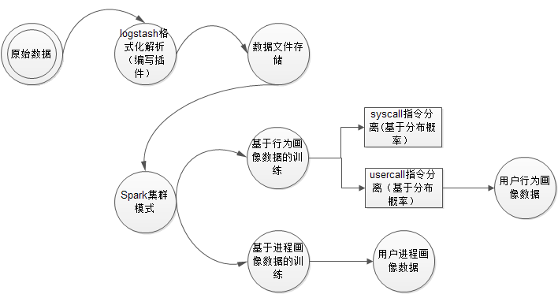{width="5.772222222222222in"
height="3.040277777777778in"}

[]{#_Toc517471824 .anchor}图3.1 训练过程

数据去重 {#数据去重 .8lab-2}
--------

PyNISA/shell/dupfilter.py文件负责将每一行日志解析为如下格式，并通过time、cmd、src和pem四个字段进行数据去重。

{

> \"time\":m.groupdict()\[\'time\'\],

\"user\":m.groupdict()\[\'user\'\],

\"ip\":m.groupdict()\[\'ip\'\],

\"cmd\":m.groupdict()\[\'cmd\'\],

\"src\":m.groupdict()\[\'src\'\],

\"dst\":m.groupdict()\[\'dst\'\],

\"ppname\":m.groupdict()\[\'perm\'\],

\"flag\":m.groupdict()\[\'flag\'\]

}

模型训练 {#模型训练 .8lab-2}
--------

训练的入口文件是PyNISA/train\_main.py，可通过提交到spark或直接运行python脚本完成训练，训练的配置文件为PyNISA/conf/
SysAudit\_train.ini和PyNISA/conf/SqlAudit\_train.ini。

### 训练命令 {#训练命令 .8lab-3}

提交到spark进行训练：

spark-submit train\_main.py conf/SysAudit\_train.ini

直接运行Python脚本进行训练：

python2.7 train\_main.py conf/SysAudit\_train.ini

### 训练入口文件 {#训练入口文件 .8lab-3}

训练的入口文件为PyNISA/train\_main.py，该文件通过读取配置文件中的参数，动态的确定是进行sql或者sys用户画像训练，通过如下代码块中红色部分完成，即通过importlib.import\_module动态加载画像模块，然后运行主函数sence.main()完成训练，最后将模型存储于Mysql中。

def buildDAG(conf={}):

modeljson=\[\]

sence=importlib.import\_module(\'train.%s.sence\_main\'
%(conf\[\'system\'\]\[\'sence\'\]))

modeljson=sence.main(conf)

if conf\[\'system\'\]\[\'store\'\]!=\'hdfs\': write2cache(modeljson)

if modeljson:

if conf\[\'system\'\].has\_key(\'upload\') and
conf\[\'system\'\]\[\'upload\'\]\<1: pass

else:

opt=core.opert.opert(conf)

if conf\[\'mysql\'\].has\_key(\'name\') and
conf\[\'mysql\'\]\[\'name\'\]:

opt.putknowledgemodeljson(modeljson)

else:

opt.putmodeljson(modeljson)

### 训练核心流程及文件说明 {#训练核心流程及文件说明 .8lab-3}

下面本文以基于系统日志的用户画像，对训练的核心流程及文件进行说明。在3.2.2中的sence.main函数，调用的为PyNISA/train/sysaudit模块中的sence\_main.py内的函数。基于系统日志的用户画像的所有处理逻辑均在PyNISA/train/sysaudit模块中实现，文件结构如图3.1所示。

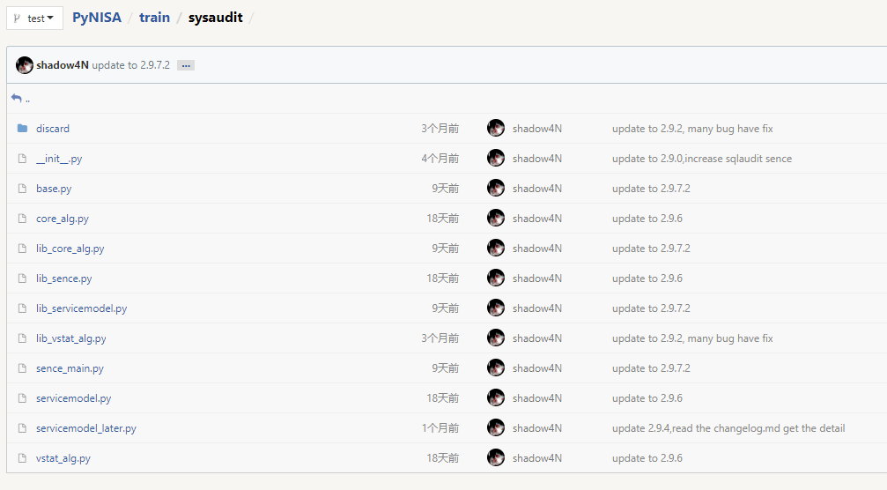{width="5.772222222222222in"
height="3.1868055555555554in"}

[]{#_Toc517471825 .anchor}图 3.2 PyNISA/train/sysaudit模块文件结构

训练过程首先加载知识并对其进行处理，然后对训练数据进行预处理，这个过程所需要的辅助功能函数均在lib\_sence.py中实现。最后完成基于服务类型、基于命令类型、核心算法以及深度学习算法的四类模型的训练。模型训练的代码块如图3.2所示，便利配置文件中指定的模型类别，然后使用importlib.import\_module动态加载对应的算法模块，使用module.algorithm初始化算法模块，并使用ComputUserprofile完成训练。

{width="5.772222222222222in"
height="2.0395833333333333in"}

[]{#_Toc517471826 .anchor}图 3.3 三类模型训练

四类模型分别在servicemodel.py、vstat\_alg.py、core\_alg.py和dl\_alg.py中进行定义，这四个文件中分别继承了base.py中定义的算法基类。而四类模型所需要的辅助功能函数在lib\_servicemodel.py、lib\_vstat\_alg.py、lib\_core\_alg.py和lib\_dl\_alg.py中实现，这四个文件中还分别定义了模型的数据结构。下面依次对这四类模型进行简要说明。

servicemodel.py主要是实现基于用户的服务类型进行特征提取，包括网络监听、网络主动外联、文件写、文件读、注册表写、注册表读等。service模型示例如下图所示。

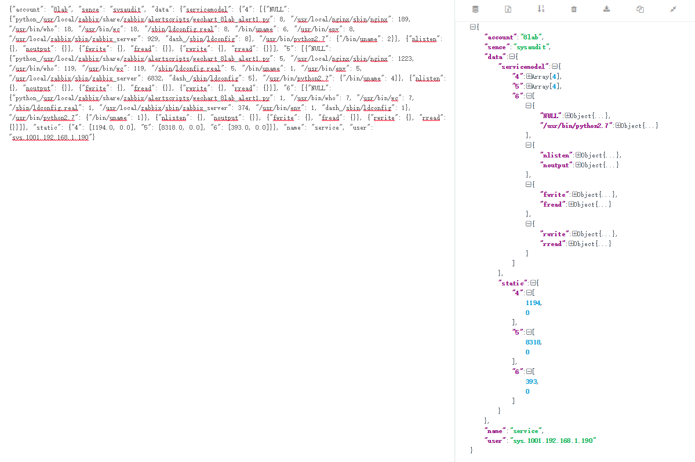{width="5.772222222222222in"
height="3.841666666666667in"}

[]{#_Toc517471827 .anchor}图 3.4 service模型示例

vstat\_alg.py主要是基于用户的操作类型进行特征提取，操作命令分类存储于PyNISA/conf/ltype.conf文件中，包含文件管理、文档编辑、文件传输、磁盘管理、磁盘维护、网络通讯、系统管理、系统设置、备份压缩、设备管理等。visual模型如下图所示。

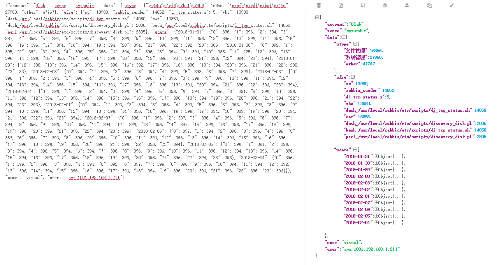{width="5.772222222222222in"
height="3.0659722222222223in"}

[]{#_Toc517471828 .anchor}图 3.5 visual模型示例

core\_alg.py主要是使用各类算法完成模型训练，包括通用模式聚类学习、基于概率分布的皮尔逊相关系数检测、马尔科夫状态转移矩阵、时间差值、命令频率、ng词袋分布等。core算法每个用户对应的每个模型均为一个字典结构，统一用户的多个模型构成一组模型列表，在对数据进行检测过程中，依次使用模型组中各个模型进行检测，然后每个模型对检测结果进行投票，即群体智慧，投票结果作为检测结果。下图是一个core算法模型示例：

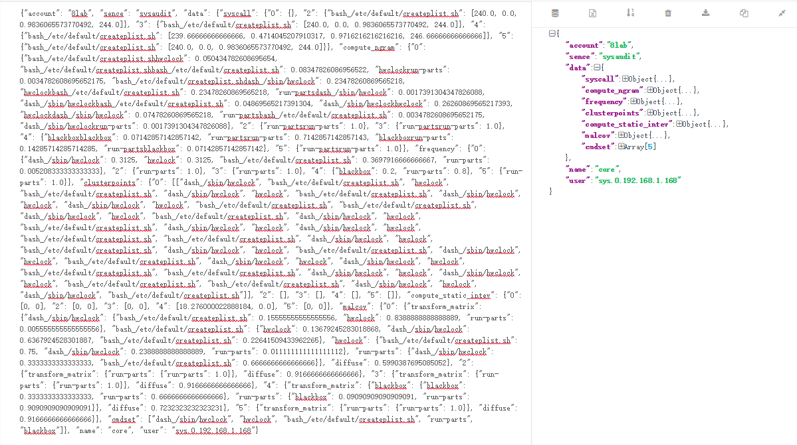{width="5.772222222222222in"
height="3.2305555555555556in"}

[]{#_Toc517471829 .anchor}图 3.6 core算法模型示例

dl\_alg.py主要完成深度学习模型的训练。

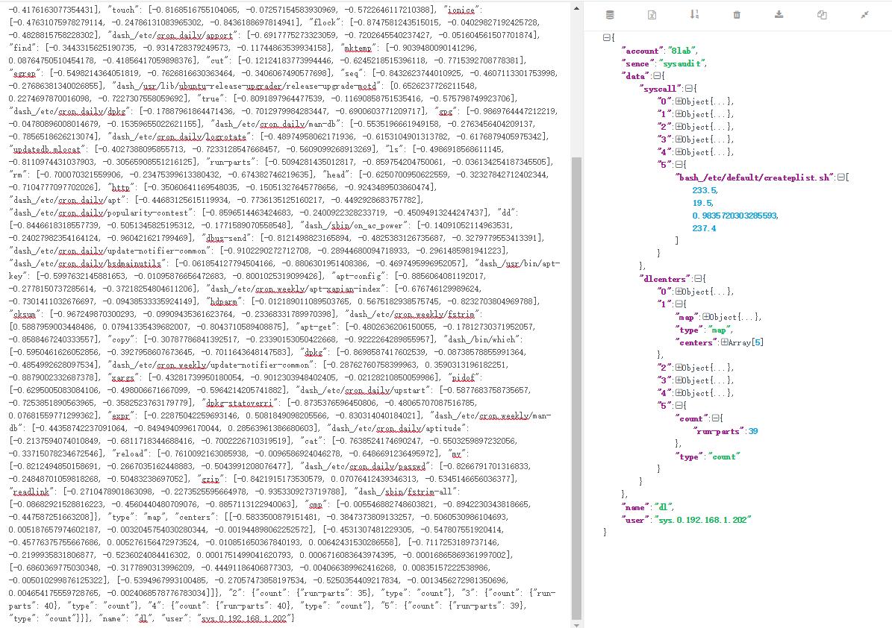{width="5.772222222222222in"
height="4.067361111111111in"}

[]{#_Toc517471830 .anchor}图 3.7 深度学习算法模型示例

模型存储 {#模型存储 .8lab-2}
--------

训练完成的模型存储于mysql中，表结构如下。

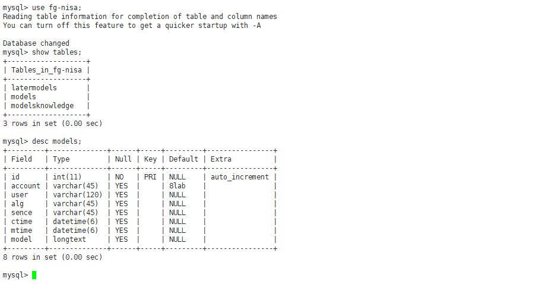{width="5.772222222222222in"
height="2.972916666666667in"}

[]{#_Toc517471831 .anchor}图 3.8 NISA模型数据库

models（模型）表各字段作用说明：

图 3.1 models表

  **字段名称**   **字段作用**
  -------------- -----------------------------------------------------------------------------------------------------------------------------------------------------
  id             主键
  account        账号，在配置文件中进行配置
  user           用户，从日志文件中进行提取
  alg            算法名字，在配置文件PyNISA/conf/目录下的SysAudit\_train.ini或SqlAudit\_train.ini文件中的**\[userprofile\]**部分定义，训练会依据该配置动态的加载算法
  sence          场景，目前分为基于系统日志（sysaudit）和基于SQL审计日志（sqlaudit）的用户画像
  ctime          模型的创建时间，在模型训练过程产生
  mtime          模型的修改时间，在模型训练或检测过程中进行更新
  model          模型的具体参数，字典结构转化为JSON，存储时采用base64编码

启动相关 {#启动相关 .8lab-1}
========

PyNISA/startZS.sh

该脚本负责启动NISA的web服务、zookeeper、kafka、NISA RPC服务、storm。

PyNISA/startTP.sh

该脚本负责提交sandbox-hdfsAuditLog-topology
、[simple-sql](http://192.168.1.21:8080/topology.html?id=simple-sql-17-1512847087)
、simple-sys三个检测Topology到storm中。

异常检测相关 {#异常检测相关 .8lab-1}
============

Topology说明 {#topology说明 .8lab-2}
------------

以simple-sys为例，Tolology的结构在

PyNISA/JyNISA/src/main/java/com/octa/jynisaSysAuditMain.java中进行定义，Topology的配置参数由PyNISA/conf/JySysAudit\_detection.ini文件控制。

首先，通过storm内置的KafkaSpout直接对接kafka中的流数据，然后，依次经过GetFieldBolt
=\> DupfilterBolt =\> HeuristicBolt =\> ServiceModelBolt =\>
DetectionBolt =\>
AlertBolt各个bolt，最终形成检测结果。其中HeuristicBolt、ServiceModelBolt、DetectionBolt三个bolt分别利用不同的算法完成对数据的检测，如果前面的bolt已检测到异常，数据仍然会流入后续的bolt，但不会再进行检测而是直接向后传递，直到AlertBolt。

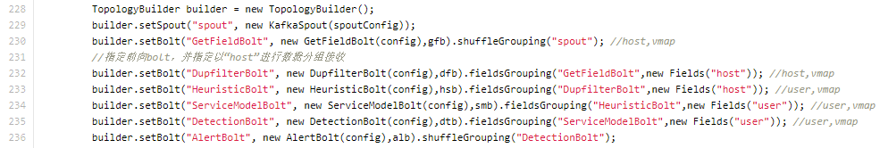{width="5.772222222222222in"
height="0.9638888888888889in"}

[]{#_Toc517471832 .anchor}图 5.1 Topology结构

其中，与Kafka和zookeeper相关的配置如下，这里配置了brokerHost，topic等。

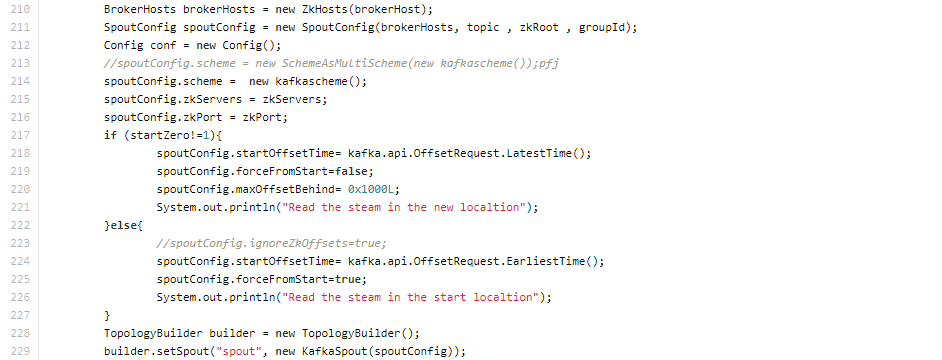{width="5.772222222222222in"
height="2.20625in"}

[]{#_Toc517471833 .anchor}图 5.2 KafkaSpout配置

其中，各bolt均由python实现，这里使用了storm对多语言的支持。以GetFieldBolt为例，可以看到它继承自ShellBolt，在构造函数（75-77行）中，直接使用python2命令，运行了对应的bolt的pyc文件。其他各bolt与之类似。

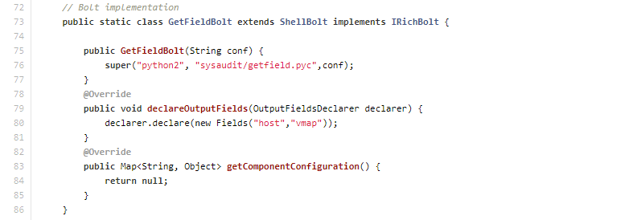{width="5.772222222222222in"
height="2.0097222222222224in"}

[]{#_Toc517471834 .anchor}图 5.3 GetFieldBolt

下面依次对各bolt的实现进行说明。

### GetFieldBolt {#getfieldbolt .8lab-3}

GetFieldBolt定义在PyNISA/JyNISA/multilang/resources/sysaudit/getfield.py文件内。该bolt负责解析日志文件成dict格式，解析通过lib.tu2dict.syslog2dict实现，格式如图5.5所示，解析后的数据输出到DupfilterBolt这一bolt继续处理。

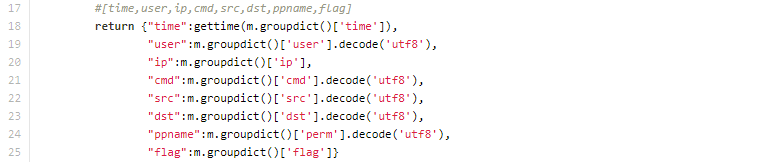{width="5.772222222222222in"
height="1.2333333333333334in"}

[]{#_Toc517471835 .anchor}图 5.4 日志解析

### DupfilterBolt {#dupfilterbolt .8lab-3}

DupfilterBolt定义在PyNISA/JyNISA/multilang/resources/sysaudit/dupfilter.py文件内，该bolt会首先依据用户知识对知识进行预处理转化，然后依据time、cmd、src、ppname四个属性进行重复判定，如果数据重复则直接返回，否则则将这条数据缓存，并将依据配置将数据写入到redis、kakfa以及文件中，然后将数据发送给HeuristicBolt。

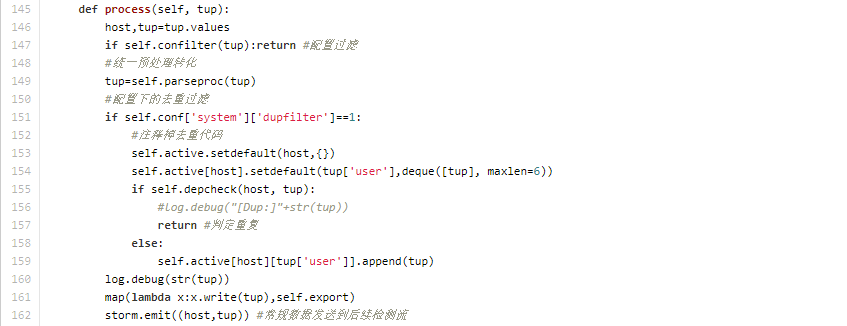{width="5.772222222222222in"
height="2.2215277777777778in"}

[]{#_Toc517471836 .anchor}图 5.5 DupfilterBolt的process函数代码

此外，在该bolt中通过RPC接口完成知识和配置的刷新，主要是通过asynmanage函数开启线程，然后由getservercomm周期性调用RPC服务获取控制命令，并通过clientact函数执行刷新操作。具体实现参见图5.6。

{width="5.772222222222222in"
height="4.754861111111111in"}

[]{#_Toc517471837 .anchor}图 5.6 DupfilterBolt中的RPC调用

### HeuristicBolt {#heuristicbolt .8lab-3}

HeuristicBolt定义在PyNISA/JyNISA/multilang/resources/sysaudit/heuristic.py文件内，该bolt使用启发式引擎完成对数据的检测。

启发式检测引擎的目的是：在宏观世界抽象出来的一些已知的恶意行为，通过对目标对象进行行为跟踪分析实现对一些已知的通用的恶意威胁行为进行精确检测和告警，典型如暴力破解，后门特性，批量篡改等。

启发式检测引擎的数据获取：Bolt从上一Bolt获取的形式是基于groupByHost
形式，即确保相同的host行为数据能够在固定的一个启发式检测线程实例上处理。

启发式检测引擎的行为跟踪分析：部分行为检测分析如图5.7所示，通过对目标对象进行针对的启发式行为分析，对其中定义的已知威胁行为进行快速精确告警。

{width="4.1387281277340335in"
height="2.9152996500437447in"}

[]{#_Toc517471838 .anchor}图 5.7 启发式检测引擎的行为跟踪分析示例

检测时，首先，缓存数据并进行强制排列，当队列中的缓存的数据时间区间超过阈值时，则开始使用启发式引擎进行检测，并根据检测结果进行不同的emit操作，这将影响后续的检测bolt是否还对这里的输出数据进行检测。

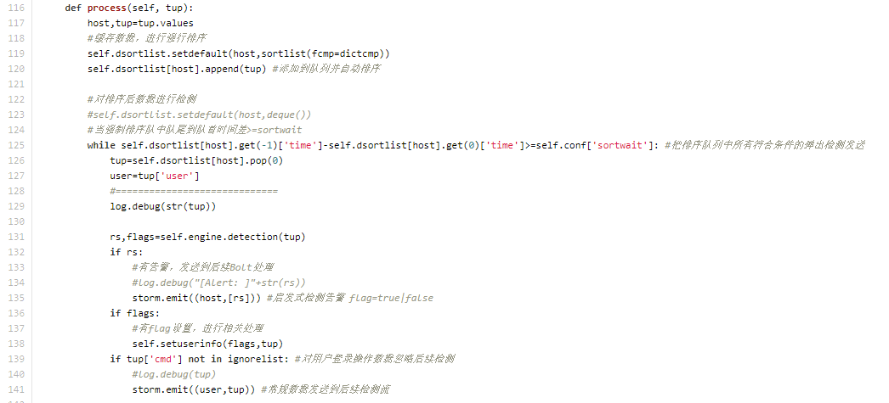{width="5.772222222222222in"
height="2.6215277777777777in"}

[]{#_Toc517471839 .anchor}图 5.8 HeuristicBolt中process函数代码

启发式引擎将根据专家知识检测是否存在ssh暴力登录，存在文件下载行为的后门，存在添加系统服务的后门等异常行为。

此外，和DupfilterBolt一样，HeuristicBolt也在内部通过周期性的调用RPC接口，更新配置数据。

### ServiceModelBolt {#servicemodelbolt .8lab-3}

该bolt主要是通过基于离线数据训练的进程服务用户画像模型，于模型训练部分中阐述的servicemodel.py相对应，主要针对包括网络监听、网络主动外联、文件写、文件读、注册表写、注册表读等行为（nlisten、noutput、fwrite、fread、rwrite、rread）进行检测，同时合并latermodels表中存储的模型到models表中。基于进程画像的异常检测过程如图所示。

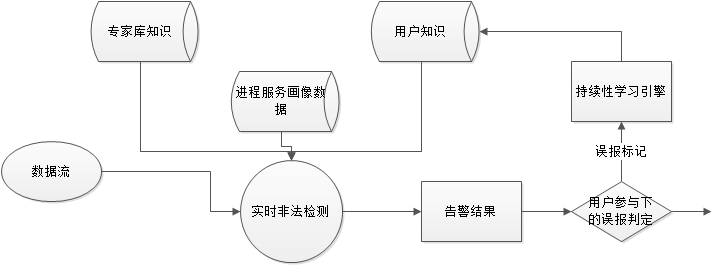{width="5.772222222222222in"
height="2.1243055555555554in"}

[]{#_Toc517471840 .anchor}图5.9 基于进程画像的异常检测过程

此外，和DupfilterBolt一样，ServiceModeBolt也在内部通过周期性的调用RPC接口，将会读取模型、更新模型并更新知识。

### DetectionBolt {#detectionbolt .8lab-3}

该bolt主要是使用模型完成对数据的检测。其中core和dl算法训练的模型均在该bolt中实际进行异常检测。

此外，和DupfilterBolt一样，DetectionBolt也在内部通过周期性的调用RPC接口，将会读取模型、并更新知识。

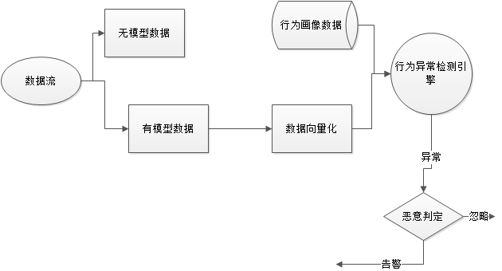{width="5.772222222222222in"
height="3.1152777777777776in"}

[]{#_Toc517471841 .anchor}图5.10 基于行为画像的异常检测过程

### AlertBolt {#alertbolt .8lab-3}

AlertBolt定义在PyNISA/JyNISA/multilang/resources/sysaudit/eaglealert.py文件内，该bolt主要是对之前各bolt检测到的异常行为进行报警，报警具备冷却机制，防止对同一用户在同一算法下的高频告警。

Python代码打包 {#python代码打包 .8lab-2}
--------------

为避免源码泄露，Topology中使用python代码会通过PyNISA/JyNISA下的setup.py和typc.sh两个脚本分别源码打包。

其中，setup.py将封装的库文件打包成.so文件，即：

multilang/resources/sqlaudit/alg/src/\*.py =\>
multilang/resources/sqlaudit/alg/\*.so

multilang/resources/sqlaudit/lib/src/\*.py =\>
multilang/resources/sqlaudit/lib/\*.so

multilang/resources/sysaudit/alg/src/\*.py =\>
multilang/resources/sysaudit/alg/\*.so

multilang/resources/sysaudit/lib/src/\*.py =\>
multilang/resources/sysaudit/lib/\*.so

typc.sh将PyNISA/JyNISA/multilang/resources下的所有bolt文件包成.pyc文件。

知识补偿相关 {#知识补偿相关 .8lab-1}
============

知识概述 {#知识概述 .8lab-2}
--------

专家知识保存于PyNISA/conf/sys\_knowledge.py文件中，包括数据预解析、检测知识、组合敏感知识，离线数据训练和在线行为检测过程中都会动态import该文件。各配置文件需要手动配置专家知识文件路径。

\#数据预解析

parse\_userknowledge={\"randompath\":randompath, \# 随机路径

\"randomcmd\":randomcmd} \# 随机命令-因脚本执行时命令由脚本路径组合成

\#检测知识

detection\_userknowledge={\"trustPP\":trustPP, \#
可信父进程-数据来源perm

\"trustsub\":trustsub, \# 可信子进程-数据来源cmd

\"trustPsub\":trustPsub, \# 可信父子进程关系

\"trustfwrite\":trustfwrite, \# 可信写路径

\"trustfread\":trustfread, \# 可信读路径

\"trustconnect\":trustconnect} \# 可信连接输出

\# 敏感知识

sensitive\_knowledge={\"sys\_sensitivepath\":sys\_sensitivepath, \#
敏感路径

\"user\_sensitivepath\":user\_sensitivepath,

\"sys\_sensitivecmd\":sys\_sensitivecmd, \# 敏感命令

\"user\_sensitivecmd\":user\_sensitivecmd,

\"behavior\_sensitive\":behavior\_sensitive} \# 组合敏感行为

\# 启发式知识

heuristic\_knowledge={\'heuristic\_flag\':heuristic\_flag, \#
定义几类操作的相关信息

\'heuristic\_rule\':heuristic\_rule} \#
主要通过设置指定操作的持续时间来设置规则

训练过程使用 {#训练过程使用 .8lab-2}
------------

模型的训练过程重要使用了专家知识中的数据预解析（parse\_userknowledge），主要是处理随机路径和随机命令，进而将数据结构化。

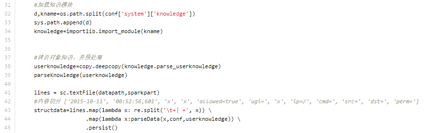{width="5.772222222222222in"
height="1.7930555555555556in"}

[]{#_Toc517471842 .anchor}图6.1 模型训练中专家知识的使用

检测过程使用 {#检测过程使用 .8lab-2}
------------

### DupfilterBolt中的使用 {#dupfilterbolt中的使用 .8lab-3}

DupfilterBolt中先通过getknowledge函数获取专家知识，这里使用的是数据预解析（parse\_userknowledge），并保存在self.userknowledge中，然后在parseproc函数中使用专家知识进行数据预处理。

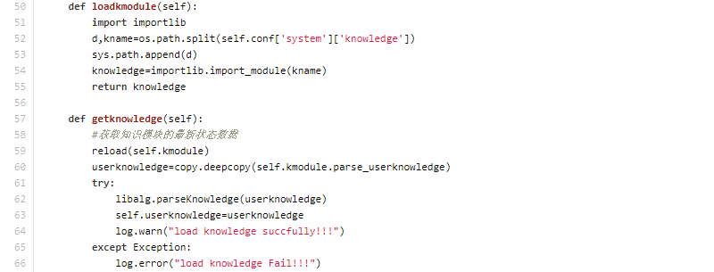{width="5.772222222222222in"
height="2.2006944444444443in"}

[]{#_Toc517471843 .anchor}图6.2 DupfilterBolt中获取知识

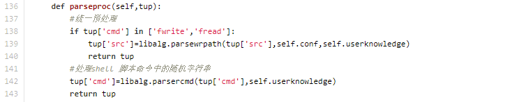{width="5.772222222222222in"
height="1.1402777777777777in"}

[]{#_Toc517471844 .anchor}图6.3 DupfilterBolt中使用知识

### HeuristicBolt中的使用 {#heuristicbolt中的使用 .8lab-3}

HeuristicBolt主要使用heuristic\_knowledge，也是通过getknowledge获取专家知识，并通过专家知识初始化启发式检测引擎（定义于文件：PyNISA/JyNISA/multilang/resources/sysaudit/lib/src/
heuristicEngine.py），然后在process函数中完成检测。

启发式检测引擎在检测的过程中，会依据启发式规则知识（heuristic\_flag，其中store，代表标记值，condition代表）设置数据的标记，分为两种：

数据的标记如果设置为**1**，则表示孤立标记存储，新状态会刷新历史状态。如针对具有下载行为的后门，如果两条\'download\'，\'auth\_succ\'类型的数据，二者的前后时间小于5则认为是后门程序。

flag=\>

\'auth\_succ\':{**\'store\'**:1,**\'condition\'**:{\'cmd\':{\'content\':\[\'user\_auth\'\]},\'flag\':{\'content\':\[\'true\'\]}},\'type\':\[\'auth\_succ\'\]},

\'download\':{\'store\':1,\'condition\':{\'cmd\':{\'content\':\[\'curl\',\'wget\'\]}},\'type\':\[\'download\'\]},

rule=\>

\'backdoor1\':\[{\'key\':\'download\'},{\'key\':\'condition\',\'timedf\<=\':\[\'download\',\'auth\_succ\',5\]},{\'key\':\'msg\',\'message\':\"\$heuristic\_backdoor\"}\],

数据的标记如果设置为2，则表示队列模式，按照设定排序存储，并由max关键字设定存储长度，不支持多标记。如针对ssh暴力登陆的检测，如果队列首尾间的时间跨度小于60秒，则认为是ssh暴力登录行为。

flag=\>

\'auth\_fail\':{**\'store\'**:2,**\'max\'**:10,**\'condition\'**:{\'cmd\':{\'content\':\[\'user\_auth\'\]},\'flag\':{\'content\':\[\'false\'\]}},\'type\':\[\'auth\_fail\'\]}

rule=\>

\'sshbrute\':\[{\'key\':\'auth\_fail\',\'minlen\':5,\'tailhead\<=\':60},{\'key\':\'msg\',\'message\':\"\$heuristic\_sshbrute\"}\],

目前支持的队列长度条件如下：

\#minlen 存储队列最小长度

\#maxlen 存储队列最大长度

目前支持的时间跨度条件如下：

\#tailhead\<= 存储结构尾首时间差\<=

\#tailhead\>= 存储结构尾首时间差\>=

\#tailhead== 存储结构尾首时间差==

\#timedf\<=
传递两个flag参数,一个时间参数，当前一个和后一个标志的时间差\<=时间设定时，返回真

\#timedf\<=
传递两个flag参数,一个时间参数，当前一个和后一个标志的时间差\>=时间设定时，返回真

\#timedf==
传递两个flag参数,一个时间参数，当前一个和后一个标志的时间差==时间设定时，返回真

### ServiceBolt中的使用 {#servicebolt中的使用 .8lab-3}

ServiceBolt主要使用detection\_userknowledge，检测进程服务异常。ServiceBolt也是通过getknowledge函数获取专家知识，并在process函数中完成检测。

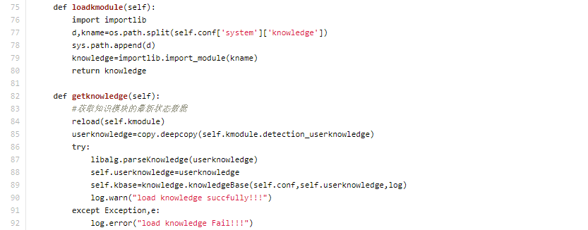{width="5.772222222222222in"
height="2.259027777777778in"}

[]{#_Toc517471845 .anchor}图6.4 ServiceBolt中获取知识

但与DupfilterBolt不同的是:

ServiceBolt使用PyNISA/JyNISA/multilang/resources/sysaudit/lib/knowledge.py中定义的**knowledgeBase**类来实例化知识，并在检测的过程中使用**knowledgeBase**类中的**servicemodeldecide**函数完成进程服务异常检测。**servicemodeldecide**函数首先使用knowbase.py文件中定义的commonknowledge函数进行异常检测，主要是检测交互式进程（如bash\|sh\|dash\|-dash\|-bash\|python(\\S+)?\|perl等）存在的异常，然后依次使用专家知识中的进程服务异常检测知识（detection\_userknowledge），依次进行检测。分别是可信写路径检测（checkwithTrustfwrite）、可信读路径检测（checkwithTrustfread）、可信连接输出检测（checkwithTrustconnect）、可信子进程检测（checkwithTrustsub）、可信父进程检测（checkwithTrustPP）、可信父子关系检测（checkwithTrustPsub）。如图6.5所示。

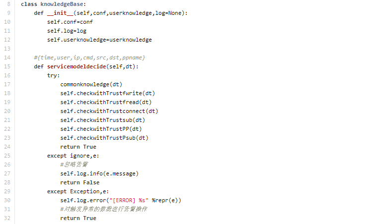{width="5.772222222222222in"
height="3.55in"}

[]{#_Toc517471846 .anchor}图6.5 knowledgeBase类

可信写路径检测使用的是专家知识中的trustfwrite、可信读路径检测使用的是专家知识中的trustfread、可信连接输出检测使用的是专家知识中的trustconnect、可信子进程检测使用的是专家知识中的trustsub、可信父进程检测使用的是专家知识中的trustPP、可信父子关系检测使用的是专家知识中的trustPsub。

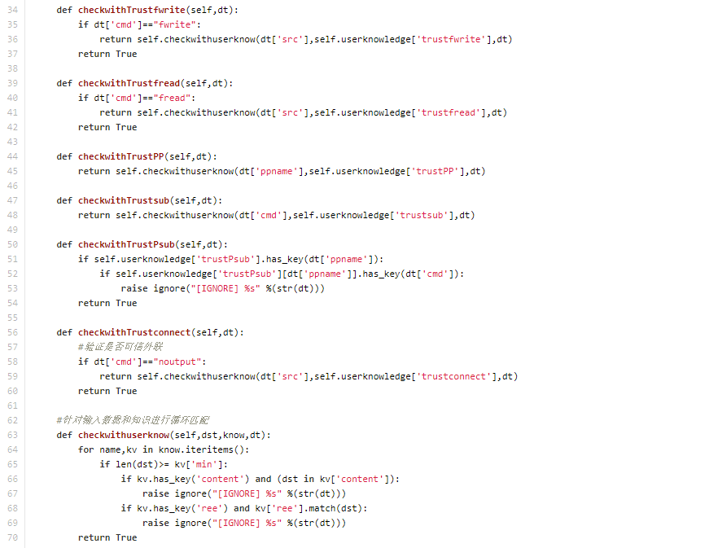{width="5.772222222222222in"
height="4.459722222222222in"}

[]{#_Toc517471847 .anchor}图6.6
detection\_userknowledge在knowledgeBase类中的具体使用

### DetectionBolt中的使用 {#detectionbolt中的使用 .8lab-3}

DetectionBolt主要使用sensitive\_knowledge，检测异常。ServiceBolt也是通过getknowledge函数获取专家知识。

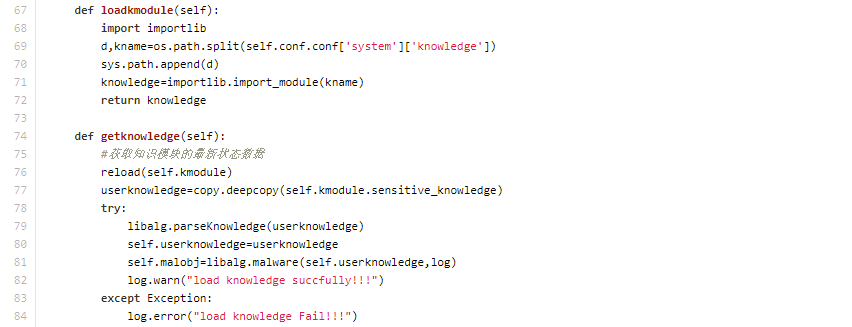{width="5.772222222222222in"
height="2.2152777777777777in"}

[]{#_Toc517471848 .anchor}图6.7 DetectionBolt获取知识

DetectionBolt使用PyNISA/JyNISA/multilang/resources/sysaudit/lib/lib\_alg.py中定义的**malware**类来实例化知识。DetectionBolt在process函数中，调用**malware**类的setflag函数基于
sensitive\_knowledge中定义的系统敏感路径知识（sys\_sensitivepath）和系统敏感命令知识（sys\_sensitivecmd）来进行异常检测，其中系统敏感路径知识异常检测由checkpathwithknowledge函数完成，系统敏感命令知识异常检测由checkcmdwithknowledge函数完成。

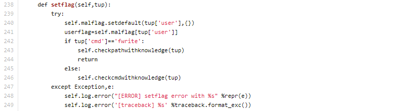{width="5.772222222222222in"
height="1.5263888888888888in"}

[]{#_Toc517471849 .anchor}图6.8 malware类异常检测函数

增加专家知识 {#增加专家知识 .8lab-2}
------------

### detection\_userknowledge知识测试 {#detection_userknowledge知识测试 .8lab-3}

#### 准备测试脚本 {#准备测试脚本 .8lab-40}

创建一个文件malware，内容如下。使用chmod +x
malware增加可执行权限，然后移动到/usr/local/bin目录下。

\#!/bin/bash

for((i=1;i\<=1000;i++));

do

echo \$(expr \$i \\\* 3 + 1);

rm -rf test\_file123456778adsfdasfads

done

在命令行直接输入malware进行运行，可以看到报警

{width="5.772222222222222in"
height="3.2472222222222222in"}

[]{#_Toc517471850 .anchor}图6.9 测试脚本触发报警

#### 增加专家知识 {#增加专家知识-1 .8lab-40}

增加专家知识，需要按照指定的格式进行添加。

\#可信父进程-数据来源perm

\#同时支持正则和内容匹配语法

trustPP={

\"shAPP\":{\"ree\":\"(/bin/)?(sh\|bash\|dash\|busybox)(\\+-(c\|e))?\\+(/etc/cron.daily\|/usr/local/zabbix\|/usr/lib)\",\"min\":25},

\"shAPP2\":{\"ree\":\"((python\|bash\|dash\|sh\|perl\|busybox)\_)?(/usr/local/zabbix\|/etc/default/createplist\|/root/set-vpn\|/etc/cron.daily\|/proc/self\|/data/script\|/lib/resolvconf\|/usr/lib)\",\"min\":10},

**\"malware\":{\"ree\":\"(/bin/)?(bash)(\\+\|\_)/usr/local/bin/malware\",
\"min\":27}**

}

其中：

ree：定义了敏感路径的正则表达式

min：定义了路径最小长度

专家知识添加完毕后，重新在命令行运行malware将不再继续报警。

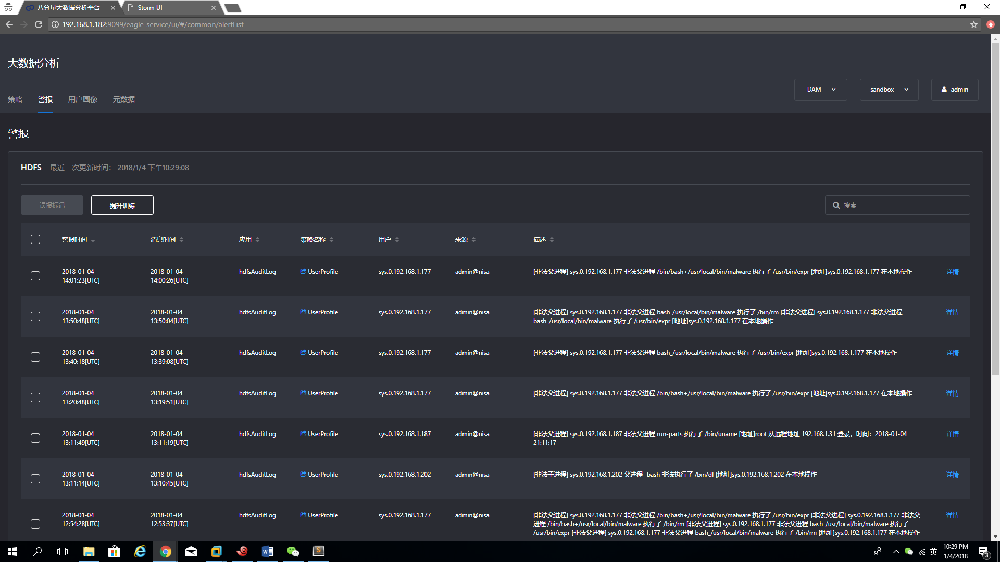{width="5.772222222222222in"
height="3.2472222222222222in"}

[]{#_Toc517471851 .anchor}图6.10 测试脚本不再触发报警

### sensitive\_knowledge知识测试 {#sensitive_knowledge知识测试 .8lab-3}

#### 准备测试脚本 {#准备测试脚本-1 .8lab-40}

创建一个文件malware，内容如下。使用chmod +x malware增加可执行权限

\#!/bin/bash

for((i=1;i\<=1000;i++));

do

echo \$(expr \$i \\\* 3 + 1);

vim /usr/local/bin/malware &

done

#### 增加专家知识 {#增加专家知识-2 .8lab-40}

增加专家知识，需要按照指定的格式进行添加。主要是设置【路径】/usr/local/bin/malware和【命令】vim为敏感信息。

在sys\_sensitivepath中添加一条：

\'malware\':{\'ree\':\'/usr/local/bin/malware\',\'min\':22,\"flag\":5,\'type\':\[\'web\'\]

在sys\_sensitivecmd中添加一条：

\"vim\":{\"flag\":5,\'type\':\[\'vim\'\]}

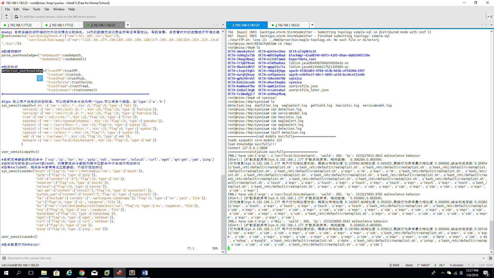{width="4.786326552930884in"
height="2.9319444444444445in"}

[]{#_Toc517471852 .anchor}图6.11 增加专家知识

#### 报警测试 {#报警测试 .8lab-40}

运行./malware。

会在nisa的docker中的/tmp/sysnisa/detection.log中看到详细的检测内容和报警信息。

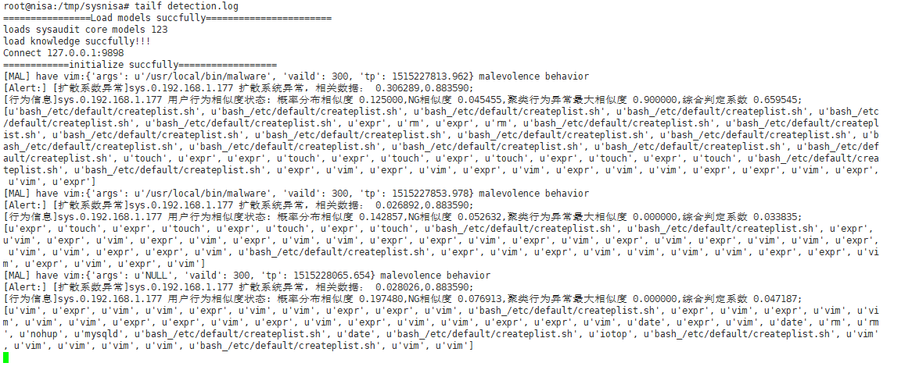{width="5.772222222222222in"
height="2.3465277777777778in"}

[]{#_Toc517471853 .anchor}图6.12 报警日志

同时，在nisa的web页面上也可以看到报警信息。

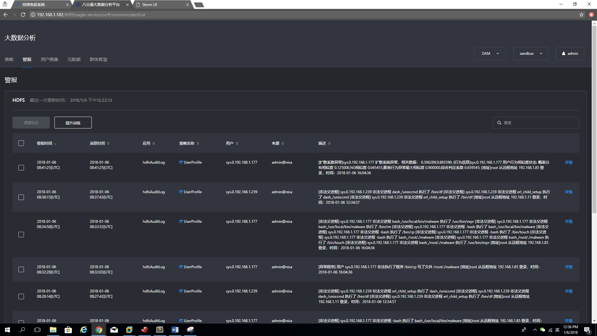{width="5.772222222222222in"
height="3.2472222222222222in"}

[]{#_Toc517471854 .anchor}图6.13 测试脚本触发报警

RPC服务相关 {#rpc服务相关 .8lab-1}
===========

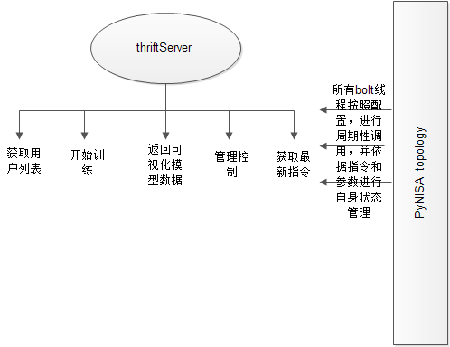{width="4.417391732283464in"
height="3.4055161854768152in"}

[]{#_Toc517471855 .anchor}图7.1 RPC服务

controlCentre {#controlcentre .8lab-2}
-------------

string controlCentre(1:string argslist)

\#{\'method\':\'set\',\'command\':\"str\_comm\",\'data\':{}}

\#command: updatemodels\|resetconfig

\#{\'method\':\'get\',\'timep\':上一条有效指令的时间戳} -\>
{\"flag\":0,\"msg\":\"ok\",\"command\":\"\",\'data\':{},\'timep\':xxx}

该RPC接口主要用户NISA内部：

1.  用户获取最新的训练的模型数据或者配置数据到内存中，这个主要是每次调用train进行训练，训练完成后在trainThread中调用该接口。

2.  用于各bolt内部，完成模型、知识和配置的重新加载，主要是通过asynmanage函数开启线程，然后由getservercomm周期性调用controlCentre
    这一RPC服务获取控制命令，并通过clientact函数执行刷新操作。

userInfo {#userinfo .8lab-2}
--------

string userInfo(1:string argslist)

用来设置获取用户相关信息的接口，参数结构{\'type\':\[\'set\'\|\'get\'\],'user\':xxx,\'skey\':xxx,\'setdata\':{k:v,\...},\'gkey\':\[k1,k2,k3\]}

type:设置接口调用类型，信息设置或者信息获取

user:操作用户对象

skey:适用于type为set时，通过设置skey传递对setdata的数据，skey-setdata对应

setdata:适用于type为set时，通过一个或多个kv结构设置信息

gkey：适用于type为get时，通过user获取对应用户的所有信息，若有key结构，则只返回对应key的用户信息

该RPC接口主要用于设置和获取用户信息

具体的实现逻辑由BoltUserInfo类进行控制，它用来存储异步用户的各类信息，通过在PynisaHandler中定义BoltUserInfo的对象self.userinfobj这一数据成员，来实现在不同的bolt处理过程中共享。其中HeuristicBolt类进行用户信息设置，eaglealert类进行用户信息读取。即数据在Topology中，流经HeuristicBolt时，会解析报警主机的IP信息，并通过userInfo这一RPC接口完成设置，如果数据最终产生报警，那么在eaglealert中会通过userInfo这一RPC接口读取用户信息。

设置用户信息的参数如下：

{\"type\":\"set\",\"user\":tup\[\'ip\'\],\"setdata\":{\"login\":{\"user\":tup\[\'dst\'\],\"addr\":tup\[\'src\'\],\"time\":tup\[\'time\'\]}}}

具体示例如下图中的消息部分：

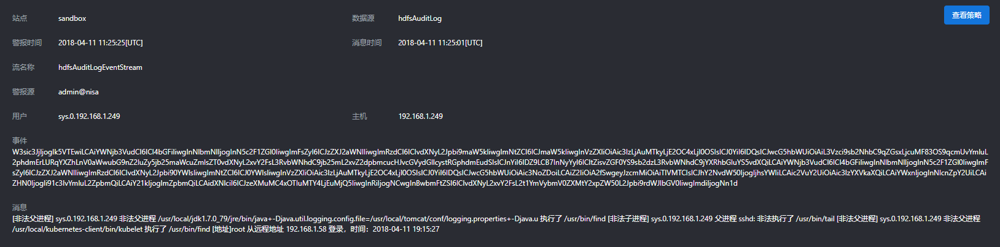{width="5.772222222222222in"
height="1.4291666666666667in"}

[]{#_Toc517471856 .anchor}图7.2 用户信息示例

train {#train .8lab-2}
-----

\#在线训练和误报标记相关

string train(1:string argslist,2:string ttype)

传递控制参数,服务器立即开始根据参数进行训练生成模型,并返回所有用户画像数据,数据类型\[json\_str\_model,\...\]

ttype:标识训练类型，支持\'normal\'和\'later'两种（前一种为常规训练，后为增量提升训练）,当把ttype设为\'status\'时，接口返回当前引擎中训练任务状态

该RPC接口主要与模型的训练相关，提供三种功能：

1.  status：获取引擎的中的训练任务状态。

2.  normal：常规训练，与【3.2模型训练】中相同，读取离线数据去重并进行训练。

3.  later：增量提升训练，主要通过later\_main.py调用servicemodel\_later.py完成数据训练，训练完成后，依据参数确定是否存储模型到数据库。

模型训练完成后，会调用内部的RPC接口controlCentre使得各Bolt内完成功能新模型的加载工作。如果是常规训练，还会更新当前缓存的可视化画像数据。

最后，更新PynisaHandler内部存储模型数据的数据成员self.models

getmodel {#getmodel .8lab-2}
--------

string getmodel(1:string user,2:string name)

根据输入参数,用户名和算法名,返回对应用户画像数据,返回数据\[json\_str\_model,\...\],可使用\"\*\"进行模糊查询

该RPC接口主要是从PynisaHandler内部存储模型数据的数据成员self.models获取指定的模型数据，并返回。模型示例：

getuserlist {#getuserlist .8lab-2}
-----------

string getuserlist()

返回用户列表

该RPC接口主要是从PynisaHandler内部存储模型数据的数据成员self.models获取所有的用户信息，并返回。

putknowledge {#putknowledge .8lab-2}
------------

string putknowledge(1:string knowledge)

参数为传递的用户标记知识，使用原始json格式即可支持数组列表模式和单字典模式，{}
或\[{},{}\]，返回成功与否标识

该RPC接口主要是将用户提供的标记知识写入data/userknowledge.txt文件中。

getmodelsknowledge {#getmodelsknowledge .8lab-2}
------------------

\#\#\# 多模型数据支持支持接口

string getmodelsknowledge(1:string argslist)

用于读取模型知识，参数使用json结构传递，{"type\":\[\"data\"\|\"meta\"\|\"sum\"\],\"id\":xxx,\"size\":20,\"start\":0,\"search\":{account:xx,user:xx,alg:xx,sence:xx,utieme:{min:xx,max:xx},mname:xx,desctext:xx}}

data:用于读取对应id号对应的模型原始数据，其中通过id来请求对应数据

meta：用户读取多个模型知识的元数据，通过size，start控制每次返回元数据的个数和起点,当传递search时通过如上参数进行搜索控制,其中mname,desctext支持模糊搜索

sum：用于获取当前数据库模型知识的个数

该RPC接口主要是获取模型相关数据，包括模型知识个数、指定ID的模型数据以及模型的元数据。操作的数据库中modelsknowledge这个表，表结构如下。

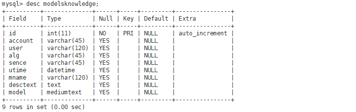{width="4.636363735783027in"
height="1.4703379265091863in"}

[]{#_Toc517471857 .anchor}图7.3 modelsknowledge表

模型数据示例：

updatemodelsknowledge {#updatemodelsknowledge .8lab-2}
---------------------

string updatemodelsknowledge(1:string argslist)

用于更新数据库中的模型知识，参数结构为{\"type\":\[\"meta\"\|\"data\"\],\"id\":xxx,\"data\":{\'model\':xxx}，\"meta\":{k:v,k:v}}

meta:用于更新模型知识元数据，支持更新除id之外的所有数据元数据，通过额外的meta
json结构传递具体更新后的元数据

data：用于更新模型知识的模型数据，通过额外的data
json结构数据传递更新后的模型数据,指定id更新对应模型数据

deletemodelsknowledge {#deletemodelsknowledge .8lab-2}
---------------------

string deletemodelsknowledge(1:string argslist)

删除指定的模型知识，参数结构{\"type\":\[\'all\'\|\'list\'\],\'list\':\[1,2,3,4\]}

all:删除所有模型知识

list:删除指定的模型知识，通过list结构体传递

loadmodels2knowledge {#loadmodels2knowledge .8lab-2}
--------------------

string loadmodels2knowledge(1:string argslist)

从检测表中根据条件，加载检测模型数据到知识模型表中，{\"user\":\[\],\"alg\":\[\],\"mname\":\"xxx\",\"desctext\":xxxxxx}

user:加载指定用户模型，list列表，可多个，使用\*进行全部选择

alg:加载指定算法的模型，\*进行全部匹配

mname,desctext指定知识模型的统一命名和描述

该RPC接口主要是将模型以及知识描述一起形成知识。首先是依据条件从models表中获取指定的模型数据，然后整合参数中传递的知识模型名称和描述，再将数据插入到modelsknowledge表中。

mergemodelsknowledge {#mergemodelsknowledge .8lab-2}
--------------------

string mergemodelsknowledge(1:string argslist)

根据传递的参数对知识模型进行融合，{\"src\":\[1,2,3,4,\...\],\"mname\":\"xxx\",\"desctext\":xxxxxxxxx,\"dst\":\"detection\|knowledge\"}

src:指定需要融合的模型id

name:新生成的模型命名

desc：新生成模型详细描述

dst:生成的模型加载到哪里，detection存储到检测表，knowledge则存储到知识模型表

该RPC主要是将指定的一组知识模型首先从modelsknowledge表中取出，然后依次处理service算法融合和core算法融合。

其中service算法融合首先是融合servicemodel数据结构，service算法主要是检测交互式进程（如bash\|sh\|dash\|-dash\|-bash\|python(\\S+)?\|perl等）存在的异常。融合包括合并新出现的分区，合并cmd，以及合并file/net/reg；然后是融合static数据结构，包括合并新分区以及模型参数取均值。

其中core算法融合，core算法的主要作用是完成模型训练，包括通用模式聚类学习、基于概率分布的皮尔逊相关系数检测、马尔科夫状态转移矩阵、时间差值、命令频率、ng词袋分布等。core算法融合主要是融合模型的数据，其中每条数据是字典或者是列表结构，如果是字典则append新的list中，如果是list则与原有的list进行合并。list中多个模型在检测过程中会依次对被检测数据进行检测，然后投票决定检测结果。

模型融合完成后，存储到数据库中对应的表中。

optknowledge {#optknowledge .8lab-2}
------------

string optknowledge(1:string argslist)

根据传递的参数路径返回知识类型或知识列表，{\"type\":\"\[get\|add\|del\|update\]\",\"path\":\"/\[type1/\[type2\]/\[knowledgename\]\]\",\[\"data\":{}\]}

type:用户指定用户对知识的操作，分为增删改查

get:根据输入path获取知识大类别（使用"/"),知识子类（使用"/type1\"),知识列表（使用"/type1/type2"),知识详情（使用\"/type1/type2/knowledgename\")

add:根据输入的path添加对应的知识（同一目录下不能出现同名），使用data接收新知识的数据（json格式，不同的知识类型有不同的知识数据结构，根据type1/type2进行校验新添知识知否合法）

del：根据输入路径删除对应的知识，只支持对具体制定知识名的知识进行删除，如："/type1/type2/deletename\"

update:根据输入的制定知识进行数据更新，使用data接收需要更新的数据结构（json格式，不同的知识类型有不同的知识数据结构，只更新data结构里面的数据，根据type1/type2进行校验新添知识知否合法）

savenewknowledge {#savenewknowledge .8lab-2}
----------------

string savenewknowledge()

不需要输入参数，当内存中的知识结构有过更新后，在调用此接口时，把内存中的新知识结构安装知识文件格式要求重新写入知识文件（默认sys\_knowledge),

并调用通知远程storm更新知识文件（使用RPC接口调用，\$rpcserver.controlCentre(\'{\"method\":\"set\",\"command\":\"updatemodels\"}\')
)

算法 {#算法 .8lab-1}
====

数据描述 {#数据描述 .8lab-2}
--------

原始数据是大容量的文本数据，原始的文本数据可以解析成以下以下10个字段，如下表8-1所示

表8-1 文本数据字段描述表

  pid      事件进程id                                               ip     事件产生的ip
  -------- -------------------------------------------------------- ------ ------------------------------
  ppip     事件进程的父进程id                                       user   事件执行的用户
  dst      （不定）通常是用于操作的参数，如当前进程名，当前路径等   src    参数，如uid等
  time     当前事件的具体时间与日期                                 cmd    操作的命令
  ppname   父进程的进程名                                           flag   某些命令的反馈（如用户登录）

原始文本字段字典化后的实例如下图所示：

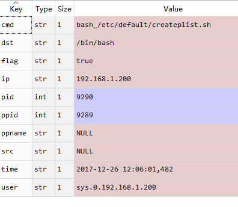{width="3.2152777777777777in"
height="2.793069772528434in"}

[]{#_Toc517471858 .anchor}图8-1 原始文本数据实例

文本数据通常比较大，所有算法对于数据的运算都在spark下运行。原始数据在进入算法之前，会经过基本的解析操作，解析操作需要通过配置文件获取知识文件userknowlege。

目前涉及到数据主要的算法主要为下文三种。

算法的选择调用通过配置文件（PyNISA\\conf\\SysAudit\_train.ini）中的\[userprofile\]字段进行调用，具体说明通过readme查看。算法的启动入口文件，即训练算法的源代码路径（PyNISA/train\_main.py）

算法一：基于behavior2vector深度学习算法的多维抽象空间行为刻画 {#算法一基于behavior2vector深度学习算法的多维抽象空间行为刻画 .8lab-2}
-------------------------------------------------------------

### 算法概述 {#算法概述 .8lab-3}

基于behavior2vector深度学习算法的多维抽象空间行为刻画算法，通过spark的groupby操作不断的对输入数据进行聚合运算，进一步对聚合得到的数据进行深度特征信息提取，如词向量等。最后对这些深度特征信息进行无监督的聚类学习，获取正常数据的行为模式。其算法对应的主要源代码路径为（算法代码主文件
PyNISA\\train\\sysaudit\\dl\_alg.py，相应的主要库文件PyNISA\\train\\sysaudit\\lib\_dl\_alg

.py）

### 算法流程 {#算法流程 .8lab-3}

深度学习的整个算法如下流程图所示，以下根据流程图的步骤进行相应描述。

[]{#_Toc517471859 .anchor}图8-2 深度学习算法流程图

如上图所示：

STEP1：将原始数据进行初步解析，获取总共八个字段的数据，八个字段的部分描述在表8-1中可见，以下主要讲述几个新解析出的字段。完整时间包含年月日时分秒所有信息，时区则是根据公式$t/(\frac{24}{v})$计算，其中v是配置文件设定的参数，默认为
6，t是时间的整点数。返回的时区为整数。时间点是指时间的整点数，如8:45则时间点8。这一步的数据是predata

STEP2:通过spark进行聚合操作，key和value如图所示

STEP3:通过spark进行聚合操做的基础上，并cmd进行统计

STEP4:对不同日期date的聚合操作，合并统计

STEP5:对统计合并操作的得到的cmd数据进行阈值判断

STEP6:合并整理STEP5的数据,进行聚合计数与阈值过滤得到Syscall data

STEP7:将syscall\_data数据字典化得到Dsyscall\_data

STEP8:将predata数据用Dsyscall data来进行过滤清洗得到cleandata

STEP9:将cleandata 根据时区与user聚合，value为完整时间与cmd

STEP10:这一步是整个算法的核心，基于词向量的思想，结合统计学的范式思想，先将数据转换为类词向量，然后通过kmeans，密度聚类等模型进行无监督学习获取模型数据。

STEP11:将STEP10的输出数据整合，作为模型数据上传到mysql中，同时也保存syscall
data到mysql中。

算法的流程如上所示，在模型的训练完之后，检测过程中，可以调用syscall\_data数据来对数据输入元进行过滤，然后通过模型数据匹配相似度，对相似度过低的数据输入样本进行报警。

算法二：基于数理统计的用户画像描述 {#算法二基于数理统计的用户画像描述 .8lab-2}
----------------------------------

### 算法概述 {#算法概述-1 .8lab-3}

Service\_model（用户画像）算法是他通过三个角度的用户数据来对用户行为进行用户画像，这三个方面的数据如下表所描述：

表8-2 service\_model数据描述

  Service\_data    记录用户在时间区间内对脚本运行，网络服务，文件读写，注册表读写的操作的计数
  ---------------- ----------------------------------------------------------------------------
  Stactic\_data    记录用户正在多个时间段内运行命令（cmd）个数的均值与方差
  Cmd\_set\_data   记录用户运行过的命令(cmd)集合

通过上表所示的三个数据，构建整体的模型数据来进行用户画像，下面分别对三个数据的算法过程进行描述。（算法代码主文件
PyNISA\\train\\sysaudit\\servicemodel.py，相应的主要库文件PyNISA\\train\\sysaudit\\lib\_servicemodel.py）

### 算法流程 {#算法流程-1 .8lab-3}

[]{#_Toc517471860 .anchor}图8-3 Service\_model算法流程图

如图8-2所示：

STEP1:将原始数据进行初步解析，获取8个字段的数据，相应的数据描述可从表8-1中得到。其中pname字段与原始数据中dst字段有一定交互。

STEP2:根据user，时区进行聚合

STEP3:根据聚合结果，对value进行计算，获取该用户在当前时区内的脚本转换行为次数（m\_process）,，网络服务监听次数（m\_net）,文件读写次数（m\_file）,注册表读写次数（m\_reg）。

STEP4:根据时区进行聚合

STEP5:整合规范上一步的数据（不进行运算），形成Service\_data

[]{#_Toc517471861 .anchor}图8-4 static\_data生成流程

如图8-4示：

STEP1:与service\_data生成一样，获取解析数据

STEP2:根据usr,时区，date对cmd进行聚合操作

STEP3:根据date最cmd的个数进行聚合操作

STEP4:根据时区对不同date的内cmd个数求该时区内cmd个数的均值与方差

STEP5:整合以上数据（不进行运算），返回static\_data

[]{#_Toc517471862 .anchor}图8-5 cmd\_set\_data生成流程图

如图8-5所示：

STEP1:从输入数据中解析获取数据。

STEP2:根据usr对cmd进行聚合操作

STEP3:根据聚合后的cmd提取出用户使用的命令的集合

STEP4:真合STEP3的 输出数据（不进行计算），生成cmd\_set\_data数据。

综上所述，在形成service\_data,static\_data,cmd\_set\_data三个方面的数据之后，将至综合起来就形成了用户画像数据，并将其保存到mysql中，在检测数据的时候，将检测数据样本与用户画像数据进行匹配，若有较大区别则出发报警。

算法三：基于多重统计学习的行为描述集成算法 {#算法三基于多重统计学习的行为描述集成算法 .8lab-2}
------------------------------------------

### 算法概述 {#算法概述-2 .8lab-3}

Core\_alg（基于多重统计学习的行为描述集成算法）最终生成包含两个部分的模型数据，通过聚类方法生成的clusterpoint数据与通过统计学习计算出来的数学模式数据等。统计学习计算出来的数据总共可以分之为5种。通过隐马尔可夫模型训练处的状态转移矩阵；概率分布；统计间隔与词袋概率，以及通过概率分布计算出的cmd集合。（算法代码主文件
PyNISA\\train\\sysaudit\\core\_alg.py，相应的主要库文件PyNISA\\train\\sysaudit\\lib\_core\_alg.py）

### 算法流程 {#算法流程-2 .8lab-3}

这两个部分的模型数据具体如以下所示：

[]{#_Toc517471863 .anchor}图8-6 Core\_alg算法聚类数据生成流程图

如图所示：

STEP1:获取算法一中提及的Syscall\_data

STEP2:获取算法一中提及的clean\_data

STEP3:获取算法一中提及的Clean\_data(此处重复描述是为了与源代码契合)

STEP4:根据user,时区，时间点对完整时间与cmd进行聚合操作

STEP:5:根据user,时区进行聚合操作，同事在value中保存时间点字段的数据，并对完整时间与cmd字段数据进行无监督聚类学习，获得聚类点数据。

STEP6:根据时间点将聚类点数据进行整合

STEP7:根据局聚类整合数据返回保存到Core\_alg算法的模型数据中。

[]{#_Toc517471864 .anchor}图 8-7 Core\_alg算法的统计模型数据生成流程图

如上图所示:

STEP1:获取clean\_data

STEP2：根据user,时区对完整时间与cmd进行聚合操作

STEP3:
根据聚合后的完整时间与cmd,计算cmd的转移矩阵，概率分布，统计间隔与词袋概率，这四个算法的具体思想可以参见代码与相关文档。同时，可以根据概率分布计算出命令集合数据cmd\_set（略微不同于前述8.2的cmd\_set）

总以上两部分的数据，可以将其整合成最后的模型数据。在检测过程中，可以将检测的数据样本根据时区与模型的聚类点数据比较，同时与查看是否符合转移矩阵，概率分布，统计间隔，词袋概率，cmd\_set的阈值要求来决定是否出发异常报警。
