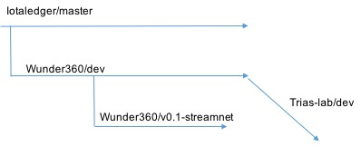

StreamNet工程说明文档

2019年02月27日

目录 {#目录 .8lab-b}
====

[版本记录 1](#版本记录)

[图片目录 1](#图片目录)

[表格目录 1](#表格目录)

[工程概述 2](#_Toc2174442)

[1 参数配置相关 3](#参数配置相关)

[2 服务启动相关 4](#服务启动相关)

[3 HTTP服务接口相关 4](#http服务接口相关)

[4 SDK接口相关 5](#sdk接口相关)

版本记录 {#版本记录 .8lab-b}
========

  **版本**   **日期**     **作者**   **修订说明**
  ---------- ------------ ---------- -----------------------
  v.1.0.0    2019-02-19   尹朝明     增加StreamNet工程说明

图片目录 {#图片目录 .8lab-b}
========

图 1 StreamNet的分支示意。 2

表格目录 {#表格目录 .8lab-b}
========

表 1 StreamNet DAG配置说明 3

表 2 StreamNet APP配置说明 3

表 3 StreamNet Sync配置说明 4

工程概述 {#工程概述 .8lab-b}
========

为了支持基于POW的区块链系统的高吞吐量，一系列方法被提出，包含侧链，分片，混合链，DAG等多种方案。我们设计了TRIAS
StreamNet，它是基于现有成熟DAG系统的全新设计，其针对现有系统容易出现双花和重放攻击，交易确认速度慢，
观察者的引入导致中心化假设等问题。以图计算中的流式图计算为基础，利用到了Katz中心度的计算来获取DAG中的一条中心链，在这个中心链中的每一个块都拥有最大的Katz得分（不是GHOST法则）。围绕中心链，通过Conflux算法可以去中心化的获得一个总的全局序的链。当新的块加入的时候，它会选择两个前置tip块来进行批准，第一个为"父"tip块，第二个是使用蒙特卡洛随机游走得到的随机tip块。StreamNet支持配置随机游走的额外检查来避免双花和算力攻击。

我们的程序提供两个服务DAG服务和APP服务。StreamNet DAG
服务原则上不直接提供应用服务，其已有的接口与IOTA保持一致。对外的服务体现在APP服务上。工程主要包含参数配置、服务启动、HTTP服务接口、SDK接口等几个部分。其中：

-   参数配置

StreamNet的DAG服务的配置例子在iri/scripts/examples里有包含如何起单台或两台StreamNet。

StreamNet的APP服务的配置例子在iri/scripts/examples里有包含如何起单台或者两台APP服务。

-   服务启动

> 该部分主要是完成StreamNet相关各服务的启动，包括启动StreamNet的DAG服务、APP服务
> 、Sync进程（注意sync进程不是对外服务，它是一个专门轮询DAG服务中关于TRIAS转账/合约信息并负责同步给TM的进程）。

-   HTTP服务接口

该部分主要是APP服务对外暴露的HTTP RESTFul API接口的说明
。其中APP服务一共提供三个应用：缓存TRIAS的TEE信息，缓存TRIAS的交易信息，StreamNet自己发行的NetCoin的交易请求。

-   SDK接口

该部分主要是提供SDK接口，方便在代码中直接对APP服务中的功能进行调用 。

StreamNet工程在coding上的URL：<https://github.com/wunder360/iri>。StreamNet工程的开发分支：dev。StreamNet工程的最新发布分支：v0.1-streamnet。同步trias-lab官方代码库的分支：trias-lab/iri/dev。

{width="3.4166666666666665in"
height="1.3902777777777777in"}

参数配置相关 {#参数配置相关 .8lab-1}
============

StreamNet的参数配置包含了DAG服务相关的配置参数和APP服务相关的配置参数。DAG相关的参数可以通过命令行输入，也可以通过conf文件来配置。APP服务相关的参数需要通过conf文件来配置。Sync进程的相关参数需要通过conf文件来配置。

表 1 StreamNet DAG配置说明

+-----------------------------------+-----------------------------------+
| **参数名称**                      | **参数说明**                      |
+===================================+===================================+
| \--testnet                        | 是否为测试网络，在公网上线前默认为这个选项 |
+-----------------------------------+-----------------------------------+
| \--mwm                            | POW的难度，参数为int型数字，默认为14 |
+-----------------------------------+-----------------------------------+
| \--walk-validator                 | 随机游走的检查方法，默认为"NULL"，表示不做检查 |
+-----------------------------------+-----------------------------------+
| \--ledger-validator               | 账本的检查方法，在v0.1-streamnet中默认为"NULL" |
|                                   | ，表示不做检查，因为这个功能还没有开发完毕 |
+-----------------------------------+-----------------------------------+
| -p                                | HTTP的监听端口，负责RESTFUL       |
|                                   | api的调用接收                     |
| \--udp-receiver-port              |                                   |
|                                   | udp 端口，负责DAG之间的UDP通信    |
| \--tcp-receiver-port              |                                   |
|                                   | tcp 端口，负责DAG之间的UDP通信    |
+-----------------------------------+-----------------------------------+
| \--remote                         | 是否接受远端服务调用请求          |
+-----------------------------------+-----------------------------------+
| \--enable-streaming-graph         | 是否启用流式图计算（这样会快些）  |
+-----------------------------------+-----------------------------------+
| \--entrypoint-selector-algorithm  | 随机游走的初始块选择算法，默认为"DEFAULT"，这个需要观察者 |
|                                   | 的引入，当选择"KATZ"的时候则没有此限制。 |
+-----------------------------------+-----------------------------------+
| \--tip-sel-algo                   | 随机游走的tip选择算法，MCMC为两个tip都是随机游走的，而C |
|                                   | ONFLUX则一个为parent，一个为随机游走。 |
| \--ipfs-txns                      |                                   |
|                                   |                                   |
|                                   | 是否将传入的信息存在IPFS中，这个主要针对信息过大的情况，需要I |
|                                   | PFS的存储空间支持。               |
+-----------------------------------+-----------------------------------+

表 2 StreamNet APP配置说明

+-----------------------------------+-----------------------------------+
| **参数名称**                      | **参数说明**                      |
+===================================+===================================+
| addr                              | 连接的DAG的地址。                 |
+-----------------------------------+-----------------------------------+
| seed                              | 发送消息时需要初始化的种子。      |
+-----------------------------------+-----------------------------------+
| enableIpfs                        | 是否将信息存入ipfs中，这个适用于信息量比较大的情况。 |
+-----------------------------------+-----------------------------------+
| enableBatching                    | 是否做批量化处理，这个适用于交易数据，做批量化处理可以增大吞吐。 |
|                                   |                                   |
| enableCompression                 |                                   |
+-----------------------------------+-----------------------------------+
| listenPort                        | HTTP的监听端口                    |
|                                   |                                   |
| listenAddress                     | HTTP的监听地址                    |
+-----------------------------------+-----------------------------------+
|                                   |                                   |
+-----------------------------------+-----------------------------------+

表 3 StreamNet Sync配置说明

  **参数名称**   **参数说明**
  -------------- ------------------
  addr           连接的TM的地址。
                 
                 

服务启动相关 {#服务启动相关 .8lab-1}
============

HTTP服务接口相关 {#http服务接口相关 .8lab-1}
================

SDK接口相关 {#sdk接口相关 .8lab-1}
===========
