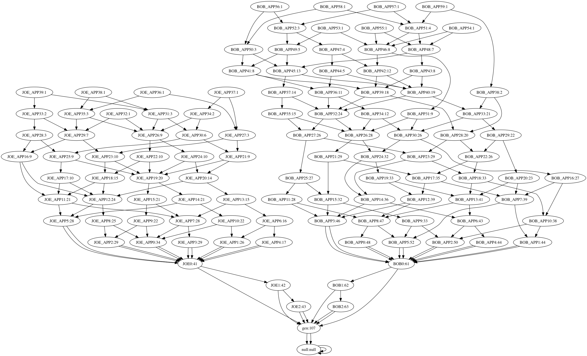

# Reproduce double-spent event and introduce edge weight  

## How to reproduce double spent test case.
To begin with, we will have a genesis transaction with Alice having 5 IOTA, then we create two transaction bundles, one with Alice transfering 5 IOTA to Bob, another with Alice transfering 5 IOTA to Joe. 
We assume the Alice->Bob transaction is the legitimate transaction and the Alice->Joe transaction is the double-spent transaction. The simulated "normal net" will issue N transactions approving Alice->Bob and the following transactions,
and the simulated "attacher net" will issue M transactions approving Alice->Joe and the following transactions. And we use Lambda to represent the interval between two stable period. Thus the issuing rate for Alice->Bob is N/Lambda and Alice->Joe is M/Lambda.  

The source code is in:

```
 ../src/test/java/com/iota/iri/service/tipselection/impl/DoubleSpendTest.java 
```

## Use the CumulativeWeight calculator 

This method is the built in method for IOTA, the weight result is shown in



And a typical tip selection result is like:
BOB: 50 JOE: 50


The source code is in:
```
../src/main/java/com/iota/iri/service/tipselection/impl/CumulativeWeightCalculator.java 
```

## Use the CumulativeWeightWithEdge calculator 

This method applies the edge weight, the weight result is shown in


And a typical tip selection result is like:
BOB: 100 JOE: 0


The source code is in:
```
../src/main/java/com/iota/iri/service/tipselection/impl/CumulativeWeightWithEdgeCalculator.java 
```
