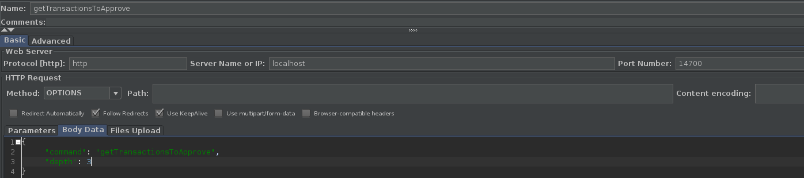
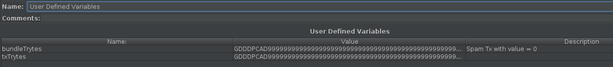
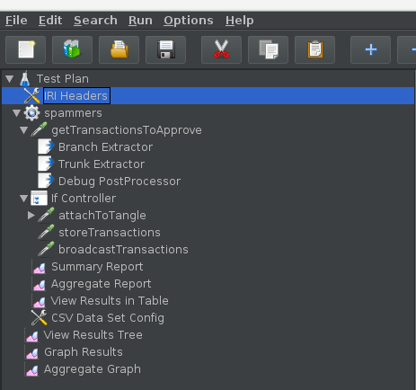

# 1.下载并安装jMeter
  可到官网下载压缩包，然后使用解压命令解压到对应的文件下，解压之后进到解压目录的 /jmeter/bin 下，使用命令：`chmod 777 jmeter.sh` 给 jmeter.sh 赋权，若有权限不够问题产生，在命令前面加上sudo。然后使用命令：`sh jmeter.sh -v` 检验是否可用。

# 2. 启动jMeter
  启动jMeter的命令是：`java -jar ApacheJMeter.jar`
  - 成功启动jMeter之后会出现一个图形化界面:
  
  
# 3. 新建测试计划
  点击file-->new 新建一个测试计划，并命名这个测试计划为：IRI_Test_Plan
  
# 4. 创建HTTP Header Manager
  单击右键Add-->Config Element-->Http Header Manager
  将其命名为：IRI Headers
  
  - 信息头管理器其作用是： 用于定制Sampler发出的HTTP请求的请求头的内容。不同的浏览器发出的HTTP请求具有不同的Agent。访问某些有防盗链的页面时需要正确的Refer...这些情况下都需要通过HTTP Header Manager来保证发送的HTTP请求是正确的
  - 然后需要填入信息头的名称及对应的值，我测试的时候name填了Content-Type，意思可以理解为参数名称、类型，值下面输入对应的参数类型就行了，这里我测试时候需要传输json类型，因此就值填入了application/json，还有一个name为X-IOTA-API-Version对应的值为1的。
  - 其参数设置如图所示：
  
  
# 5. 创建线程组
  单击右键Add-->Threads(Users)-->Thread Group 并命名为：spammers
  - 其中你需要填写一些参数如下：
    - number of Threads(Users):虚拟用户人数（设置为：4人）
    - Ramp-Up Period:相当于是线程所用的首次循环的时间范围（设置为：5秒）
    - Loop count:虚拟的次数（设置为：30次）
    - 它所表达的含义就是：1人在5秒时间内请求了30次,10人在5秒时间内就请求了120次

# 6.创建View Results Tree.......
- 创建一个和Thread Group同等级的View Results Tree和Graph Results以及Aggregate Graph。
- View Results Tree中含有三个模块块：取样器结果，请求和响应数据。
  - 测试结束后，如果我们的请求成功发送给服务器，那么结果树里面的模拟请求会显示为绿色，可以通过取样器结果里面的响应状态码信息来判断也可以点击请求模块，查看我们发送的请求。如果请求失败，模拟请求会显示为红色，并反馈error
- 测试之后，Graph Results会以线性图显示我们测试的结果；Aggregate Graph监听器可以看到表格显示的结果与图形结果，图形结果记录的是响应时间。

# 7. 创建Http Rquest
  - 在Thread Group(spammers)下面创建一个Http Request。
  - 单击右键Add-->Sampler-->Http Request   并命名为getTransactionsToApprove。其IP设置为localhost,端口号为14700
  - 服务器名称或IP:这里指的是你要访问的目标主机的域名,注意因为在前面的协议里面已经定义好了使用http(或https,一般默认为http),所以当你写名称的时候不要在前面添加“http://”了，如果是本地直接写localhost即可，后面跟的是目标服务器的端口号。
  - 最下面是Parameters、Body Data以及Files Upload。
    - Parameters是指函数定义中参数，而argument指的是函数调用时的实际参数，一般情况下两者可以混用
    - Files Upload指的是：从HTML文件获取所有有内含的资源：被选中时，发出HTTP请求并获得响应的HTML文件内容后还对该HTML进行Parse 并获取HTML中包含的所有资源（图片、flash等）：（默认不选中）
    - Body Data指的是实体数据，就是请求报文里面主体实体的内容，一般我们向服务器发送请求，携带的实体主体参数，可以写入这里，一般情况下多选用Body Data。
  - 其参数设置如图所示：
  

# 8.创建If Controller
- 在Thread Group(spammers)下面创建一个逻辑控制器If Controller，条件设置为：${JMeterThread.last_sample_ok}
    
# 9.在If Controller下创建三个Http Request
- 在这个逻辑控制器IfController下面创建三个HttpRequest,分别命名为：attachToTangle，storeTransactions和broadcastTransactions，其参数设置除了BodyData均跟getTransactionsToApprove一样。
- 其Body Data分别为：
 - 
        {
	       "command": "attachToTangle",
    	    "trunkTransaction": "${trunk_1}",
	       "branchTransaction": "${branch_1}",
	       "minWeightMagnitude": ${mwm},
	       "trytes": ["${bundleTrytes}"]
        }
 - 
        {
	        "command": "storeTransactions", 
	        "trytes": ${attached_trytes_1}
        }
 - 
        {
	        "command": "broadcastTransactions", 
	        "trytes": ${attached_trytes_1}
        }
     
# 10.创建Summary Report......
- 继续在器If Controller下面创建Summary Report和Aggregate Report以及View Results in Table。
- Summary Report参数说明： 
  - Successes：保存日志中成功的部分。
  - Configure：设置结果属性，即保存哪些结果字段到文件。一般保存必要的字段 信息即可，保存的越多，对负载机的IO会产生影响。
  - Label：取样器名称（或者是事务名）。
  - Samples：取样器运行次数（提交了多少笔业务）。
  - Average：请求（事务）的平均响应时间，单位为毫秒。
  - Min：请求的最小响应时间，单位为毫秒。
  - Max：请求的最大响应时间，单位为毫秒。
  - Std.Dev：响应时间的标准方差。
  - Error%：事务错误率。
  - Throughput：吞吐率（TPS）。
  - KB/sec：每秒数据包流量，单位是KB。
  - Avg.Bytes：平均数据流量，单位是Byte
- 还有一个CSV Data Set Config，作用是对请求参数进行参数化。
  - 其参数设置如图所示(注意：其中filename指的是mwm.cvs文件所在的目录)：
     
     
# 11.创建一个User Defined Variables
- 在getTransactionsToApprove下面创建一个User Defined Variables，用于设置参数。当测试环境变化时，我们只需要修改一处的IP就可以让脚本马上应用于另外一个环境的测试，而不需要逐个脚本进行修改。
- 其参数设置如图：
     

# 12.创建一个Debug PostProcessor
- 在getTransactionsToApprove下面创建一个Debug PostProcessor，它是常用的一个调试工具，其可以获取样本线程的相关信息进行展示，可通过查看结果树中的响应数据查看对应样本线程请求、响应及变量等信息。参数选择默认的即可

# 13.创建一个Json Extractor
- 继续在getTransactionsToApprove下面创建一个Json Extractor,并命名为attachedTrytes。用于提取json响应的数据中提取数据。
- 其参数设置如图：
  

# 14.测试结果
- 至此测试文件已经创建成功了，来看一下创建之后的整体图：
- 下面我们来测试一下，其测试结果我以图片的形式进行展示：
  
  
  
    